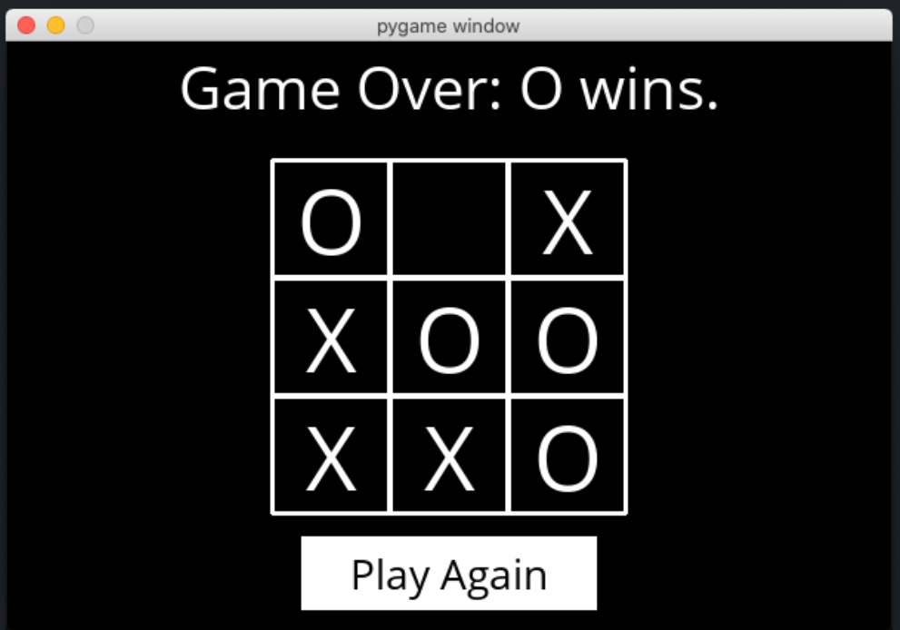
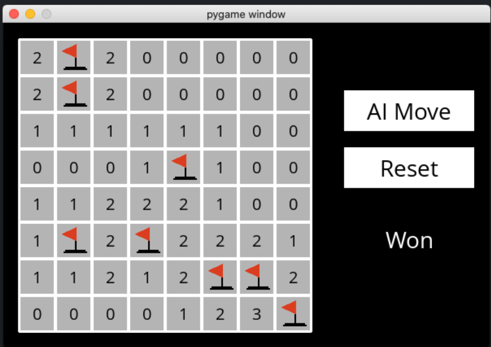

# CS50's Introduction to Artificial Intelligence Projects

My solutions for Harvard's CS50AI course.
Official course website: [cs50.harvard.edu/ai/2024](https://cs50.harvard.edu/ai/2024/)

---

## 🤖 Projects

### Week 0: Search
* **Degrees:** Found the shortest actor connection path using Breadth-First Search.

    ```
    $ python degrees.py large
    Loading data...
    Data loaded.
    Name: Emma Watson
    Name: Jennifer Lawrence
    3 degrees of separation.
    1: Emma Watson and Brendan Gleeson starred in Harry Potter and the Order of the Phoenix
    2: Brendan Gleeson and Michael Fassbender starred in Trespass Against Us
    3: Michael Fassbender and Jennifer Lawrence starred in X-Men: First Class
    ```
* **Tic-Tac-Toe:** Built an unbeatable AI player using the Minimax algorithm.

    

### Week 1: Knowledge
* **Knights:** Solved logic puzzles using propositional logic.

    ```
    python puzzle.py
    Puzzle 0
        A is a Knave
    Puzzle 1
        A is a Knave
        B is a Knight
    Puzzle 2
        A is a Knave
        B is a Knight
    Puzzle 3
        A is a Knight
        B is a Knave
        C is a Knight
    ```

* **Minesweeper:** Created an AI to solve Minesweeper via logical inference.

    

### Week 2: Uncertainty
* **PageRank:** Implemented the PageRank algorithm with Markov Chains.

    ```
    $ python pagerank.py corpus0
    PageRank Results from Sampling (n = 10000)
    1.html: 0.2223
    2.html: 0.4303
    3.html: 0.2145
    4.html: 0.1329
    PageRank Results from Iteration
    1.html: 0.2202
    2.html: 0.4289
    3.html: 0.2202
    4.html: 0.1307
    ```
    
* **Heredity:** Predicted genetic traits using Bayesian Networks.

    ```
    $ python heredity.py data/family0.csv
    Harry:
    Gene:
        2: 0.0092
        1: 0.4557
        0: 0.5351
    Trait:
        True: 0.2665
        False: 0.7335
    James:
    Gene:
        2: 0.1976
        1: 0.5106
        0: 0.2918
    Trait:
        True: 1.0000
        False: 0.0000
    Lily:
    Gene:
        2: 0.0036
        1: 0.0136
        0: 0.9827
    Trait:
        True: 0.0000
        False: 1.0000
    ```

### Week 3: Optimization
* **Crossword:** Generated crosswords using constraint satisfaction algorithms.

    ```
    $ python generate.py data/structure1.txt data/words1.txt output.png
    ██████████████
    ███████M████R█
    █INTELLIGENCE█
    █N█████N████S█
    █F██LOGIC███O█
    █E█████M████L█
    █R███SEARCH█V█
    ███████X████E█
    ██████████████
    ```

### Week 4: Learning
* **Shopping:** Predicted customer purchases with a k-NN classification model.

    ```
    $ python shopping.py shopping.csv
    Correct: 4088
    Incorrect: 844
    True Positive Rate: 41.02%
    True Negative Rate: 90.55%
    ```

* **Nim:** Trained an AI to master the game of Nim via Q-learning.

    ```
    $ python play.py
    Playing training game 1
    Playing training game 2
    Playing training game 3
    ...
    Playing training game 9999
    Playing training game 10000
    Done training

    Piles:
    Pile 0: 1
    Pile 1: 3
    Pile 2: 5
    Pile 3: 7

    AI's Turn
    AI chose to take 1 from pile 2.
    ```

### Week 5: Neural Networks
* **Traffic:** Classified traffic signs using a Convolutional Neural Network.

    ```
    $ python traffic.py gtsrb
    Epoch 1/10
    500/500 [==============================] - 5s 9ms/step - loss: 3.7139 - accuracy: 0.1545
    Epoch 2/10
    500/500 [==============================] - 6s 11ms/step - loss: 2.0086 - accuracy: 0.4082
    Epoch 3/10
    500/500 [==============================] - 6s 12ms/step - loss: 1.3055 - accuracy: 0.5917
    Epoch 4/10
    500/500 [==============================] - 5s 11ms/step - loss: 0.9181 - accuracy: 0.7171
    Epoch 5/10
    500/500 [==============================] - 7s 13ms/step - loss: 0.6560 - accuracy: 0.7974
    Epoch 6/10
    500/500 [==============================] - 9s 18ms/step - loss: 0.5078 - accuracy: 0.8470
    Epoch 7/10
    500/500 [==============================] - 9s 18ms/step - loss: 0.4216 - accuracy: 0.8754
    Epoch 8/10
    500/500 [==============================] - 10s 20ms/step - loss: 0.3526 - accuracy: 0.8946
    Epoch 9/10
    500/500 [==============================] - 10s 21ms/step - loss: 0.3016 - accuracy: 0.9086
    Epoch 10/10
    500/500 [==============================] - 10s 20ms/step - loss: 0.2497 - accuracy: 0.9256
    333/333 - 5s - loss: 0.1616 - accuracy: 0.9535
    ```

### Week 6: Language
* **Parser:** Implemented a program to parse sentences and extract noun phrases.

    ```
    $ python parser.py
    Sentence: Holmes sat.
            S
    _____|___
    NP        VP
    |         |
    N         V
    |         |
    holmes     sat

    Noun Phrase Chunks
    holmes
    ```
* **Attention:** Built a MASKED word predicter and analized attention matrix.

    ```
    $ python mask.py
    Text: We turned down a narrow lane and passed through a small [MASK].
    We turned down a narrow lane and passed through a small field.
    We turned down a narrow lane and passed through a small clearing.
    We turned down a narrow lane and passed through a small park.

    $ python mask.py
    Text: Then I picked up a [MASK] from the table.
    Then I picked up a book from the table.
    Then I picked up a bottle from the table.
    Then I picked up a plate from the table.
    ```


---
## 🙏 Acknowledgments

A huge thank you to **[Brian Yu](https://github.com/brianyu28)** and the entire **Harvard CS50 team** for creating this fantastic and challenging course.

## ⚖️ Academic Honesty

The code in this repository is for personal archival and demonstration purposes. If you are currently enrolled in the CS50AI course, please respect the academic honesty policy and do not use this code for your own submissions.