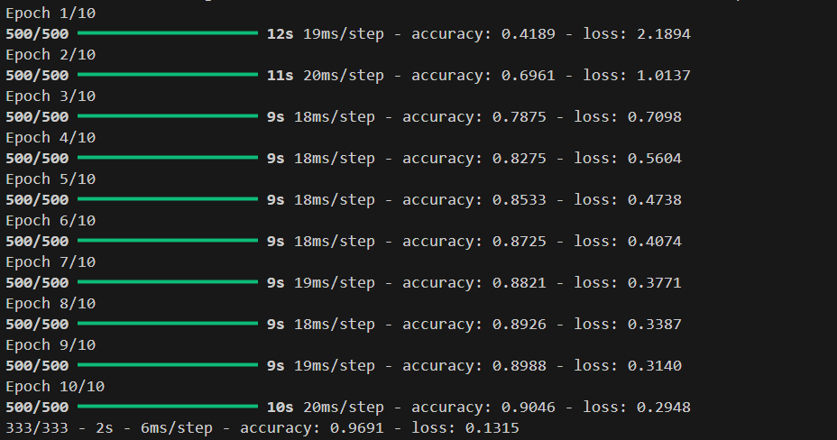
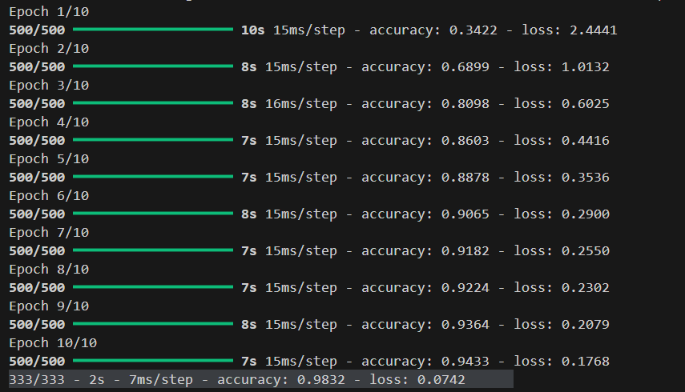
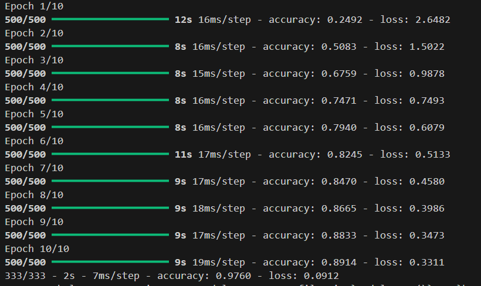
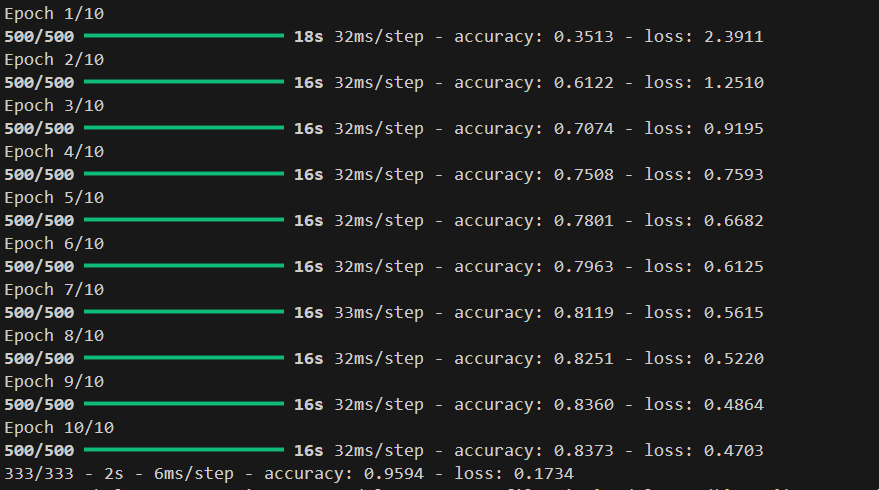

  

---

# CNN Model Experimentation for Image Classification

## Experimentation Process

During the development of my Convolutional Neural Network (CNN) model for image classification, I experimented with different configurations of convolutional layers, pooling layers, and dense layers to understand their effect on model performance. The goal was to achieve high accuracy while keeping the model efficient.

1. **Base Model:**
   - **Configuration:** 1 convolutional layer, 1 max pooling layer, 1 dense input layer, 1 output layer.
   - **Performance:** 
     ```
     333/333 - 2s - 6ms/step - accuracy: 0.9691 - loss: 0.1315
     ```
   - **Observation:** The model achieved decent accuracy but had room for improvement. Adding more layers could potentially help it learn more complex features.

     

2. **Adding One More Convolutional + Pooling Layer:**
   - **Configuration:** Added an additional convolutional layer with 64 filters and another max pooling layer.
   - **Performance:** 
     ```
     333/333 - 2s - 7ms/step - accuracy: 0.9832 - loss: 0.0742
     ```
   - **Observation:** Adding depth significantly improved accuracy and reduced loss. The model could now capture more complex patterns in the images.

    

3. **Adding One More Dense Layer:**
   - **Configuration:** Added an additional dense layer before the output layer.
   - **Performance:** 
     ```
     333/333 - 2s - 7ms/step - accuracy: 0.9760 - loss: 0.0912
     ```
   - **Observation:** The additional dense layer did not improve accuracy; in fact, it slightly decreased performance. This might be due to overfitting or redundancy in the network.

     

4. **Increasing Base Filters from 32 to 64:**
   - **Configuration:** Changed the first convolutional layer to 64 filters instead of 32.
   - **Performance:** 
     ```
     333/333 - 2s - 6ms/step - accuracy: 0.9594 - loss: 0.1734
     ```
   - **Observation:** Increasing the number of filters at the base layer without increasing network depth reduced accuracy. It seems that simply adding more filters at the first layer does not always improve performance; depth and feature hierarchy matter more.

     

## Key Takeaways

- Adding more convolutional and pooling layers generally improved the model's ability to extract features and increased accuracy.
- Simply adding dense layers before the output may not always help and can sometimes slightly reduce performance.
- Increasing the number of filters in the initial layer alone is not enough; the model benefits more from additional depth and hierarchical feature learning.
- The model achieves a good balance of speed and accuracy with 2–3 convolutional blocks followed by flattening and a single dense layer.

---

